# Olist E-Commerce Analytics Pipeline

End-to-end data analytics pipeline analyzing **96,457 delivered orders** from the Brazilian Olist e-commerce platform (2016–2018), covering the full data lifecycle from raw ingestion to interactive BI dashboards.

[](https://github.com/emaadkalantarii/ecommerce-analytics-olist/actions/workflows/ci.yml)
[](https://python.org)
[](https://postgresql.org)
[](https://docker.com)
[](https://aws.amazon.com)
[](https://public.tableau.com/app/profile/emad.kalantari/viz/OlistE-CommerceAnalytics_17776790877880/Dashboard1)

---

## Table of Contents

- [Live Dashboards](#live-dashboards)
- [Project Overview](#project-overview)
- [Key Findings](#key-findings)
- [Architecture](#architecture)
- [Tech Stack](#tech-stack)
- [Pipeline Walkthrough](#pipeline-walkthrough)
- [Data Quality](#data-quality)
- [AWS S3 Integration](#aws-s3-integration)
- [Python Visualizations](#python-visualizations)
- [Tableau Dashboard](#tableau-dashboard)
- [Power BI Dashboard](#power-bi-dashboard)
- [Streamlit App](#streamlit-app)
- [CI/CD Pipeline](#cicd-pipeline)
- [Project Structure](#project-structure)
- [How to Run](#how-to-run)
- [Dataset](#dataset)
- [Pipeline Outputs](#pipeline-outputs)
- [Skills Demonstrated](#skills-demonstrated)
- [Future Improvements](#future-improvements)
- [Author](#author)
- [License](#license)

---

## Live Dashboards

**[View Interactive Tableau Dashboard →](https://public.tableau.com/app/profile/emad.kalantari/viz/OlistE-CommerceAnalytics_17776790877880/Dashboard1)**

**[Download Power BI Dashboard (.pbix) →](dashboard_powerbi/olist_dashboard.pbix)**
> Open in Power BI Desktop to explore the full interactive dashboard with all data connections and measures intact.

---

## Project Overview

A multi-stage data analytics pipeline that ingests, cleans, transforms, and visualizes 96,457 delivered orders from the Olist Brazilian e-commerce platform across 9 relational tables. The pipeline covers the full data lifecycle — raw CSV ingestion to AWS S3, PostgreSQL database with a Bronze/Silver architecture, Python ETL automation with professional missing value handling, 18-check data quality validation, SQL-based business analysis across 8 dimensions, static visualization generation, interactive BI dashboard delivery across three platforms (Tableau, Power BI, and Streamlit), Docker containerization, and GitHub Actions CI/CD.

The project answers four core business questions: Where is revenue growing? Which product categories drive the most value? Where are delivery operations failing? And what is the measurable cost of late delivery on customer satisfaction?

---

## Key Findings

| Metric | Value |
|---|---|
| Total delivered orders analyzed | 96,457 |
| Total product revenue | R$8.7M |
| Top revenue category | Health & Beauty at R$1.24M |
| Credit card share of transactions | 74% |
| Overall late delivery rate | 10.9% |
| Worst state for late delivery | AL at 24.1% |
| Avg review score — on-time orders | 4.21 / 5 |
| Avg review score — late orders | 2.55 / 5 |
| Late orders receiving 1-star review | 46% |
| Customer repeat purchase rate | 3.0% |
| Peak revenue month | November 2017 |

---

## Architecture

```
9 Raw CSVs (Olist Dataset)
        │
        ▼
upload_to_s3.py
  - Uploads all raw CSVs to AWS S3 (Bronze layer / data lake)
        │
        ▼
load_to_postgres.py
  - Drops and recreates schema with correct data types and foreign keys
  - Loads all 9 tables into PostgreSQL in dependency order
  - Raw tables preserved exactly as received (Bronze layer)
        │
        ▼
clean_data.py
  - orders → filters to delivered only, engineers delivery_days and is_late
  - products → fixes column name typos, fills 610 null categories with 'unknown'
  - order_items → filters to delivered orders only, removes zero/negative prices
  - order_reviews → retains null comments (meaningful absence), drops null scores
  - geolocation → deduplicates to one coordinate per zip code prefix
  - order_payments → removes zero-value non-voucher payments
  → Produces 6 clean tables (Silver layer)
        │
        ▼
validate_data.py
  - 18 automated checks across raw layer, clean layer,
    referential integrity, and business logic
  - Exits with code 1 if any check fails
        │
        ▼
generate_visualizations.py
  - 7 Matplotlib/Seaborn charts saved as high-resolution PNGs
        │
        ▼
export_dashboard_data.py
  - Joins 6 clean tables into one flat dashboard-ready CSV (110,814 rows)
  - Also exports monthly_summary.csv and state_summary.csv
        │
        ▼
sql/analysis_queries.sql
  - 8 business SQL queries across revenue, categories,
    delivery, sellers, payments, retention, time, and satisfaction
        │
        ▼
Tableau Public          Power BI Desktop        Streamlit App
  4-view dashboard        4-view dashboard        4-page web app
  Revenue trend           Revenue trend           Overview + KPIs
  Top categories          Top categories          Revenue & Products
  Delivery by state       Delivery by state       Delivery Performance
  Review vs delivery      Review vs delivery      Customer Insights
  Live public URL         .pbix file in repo      Screenshots in repo
        │
        ▼
GitHub Actions CI/CD
  - Triggered on every push to main
  - Runs 12 pytest unit tests
  - Fails build if any test does not pass
```

---

## Tech Stack

| Layer | Tool | Purpose |
|---|---|---|
| Data ingestion | Python (Pandas) | Read and load raw CSVs |
| Cloud storage | AWS S3 (boto3) | Raw data lake — Bronze layer |
| Database | PostgreSQL 15 via SQLAlchemy | Relational store for raw and clean tables |
| Data transformation | Python (Pandas, NumPy) | ETL, missing value handling, feature engineering |
| Data quality | Custom validator (18 checks) | Raw, clean, referential, and business logic checks |
| SQL analysis | PostgreSQL SQL | 8 business aggregation queries |
| Visualization | Matplotlib, Seaborn | 7 static chart PNGs |
| BI Dashboard | Tableau Public | Interactive 4-view dashboard with live public URL |
| BI Dashboard | Power BI Desktop | 4-view analytical dashboard — .pbix in repo |
| Web application | Streamlit | 4-page interactive analytics app |
| Containerization | Docker, docker-compose | Reproducible PostgreSQL environment |
| CI/CD | GitHub Actions | Automated testing on every push to main |
| Version control | Git, GitHub | Source control and portfolio hosting |

---

## Pipeline Walkthrough

### Phase 1 — Raw Data Upload (`upload_to_s3.py`)

Uploads all 9 raw Olist CSV files to an AWS S3 bucket using boto3. Files are placed under a `raw/` prefix, forming the Bronze layer of the data lake. Credentials are loaded from `.env` via python-dotenv. This step is optional — the pipeline can run entirely locally without AWS credentials by skipping this script.

### Phase 2 — Database Ingestion (`load_to_postgres.py`)

Drops all existing tables in reverse dependency order using `CASCADE` to handle foreign key constraints cleanly, then recreates the full schema from `sql/create_tables.sql`. Tables are loaded in dependency order — parent tables (customers, sellers, products) before child tables (orders, order_items, order_payments, order_reviews) — to satisfy foreign key constraints during insertion. The raw tables are never modified after loading, preserving the original data exactly as received.

### Phase 3 — Data Cleaning (`clean_data.py`)

Produces 6 clean tables from the 9 raw tables using three distinct missing value strategies depending on context. Orders are filtered to delivered status only and enriched with two engineered columns: `delivery_days` (integer difference between purchase and delivery timestamps) and `is_late` (boolean flag comparing actual delivery against the estimated date). Products have the two column name typos corrected (`lenght` → `length`) and 610 null category names filled with `'unknown'` rather than dropped. Order items are filtered to delivered orders only. Reviews retain null comment text as meaningful absence but drop null scores. Geolocation is deduplicated to one coordinate per zip code prefix. Payments remove three zero-value non-voucher rows as data entry errors.

### Phase 4 — Data Quality Validation (`validate_data.py`)

Runs 18 automated SQL-based checks organized into four categories: raw layer checks (duplicates, price ranges, timestamp consistency), clean layer checks (status filter, delivery days, null enforcement), referential integrity checks (orphaned foreign keys across three relationships), and business logic checks (minimum volume thresholds, date coverage, payment values). The validator prints a pass/fail result for each check and exits with code 1 if any check fails, which blocks the CI/CD pipeline from passing.

### Phase 5 — Visualization Generation (`generate_visualizations.py`)

Queries the clean PostgreSQL tables directly and produces 7 Matplotlib/Seaborn charts saved as 150 DPI PNG files. Each chart is built from a dedicated SQL query rather than loading the full dataset into memory, keeping memory usage low and ensuring the charts always reflect the current state of the database.

### Phase 6 — Dashboard Data Export (`export_dashboard_data.py`)

Joins all 6 clean tables into a single flat CSV (`dashboard_data.csv`) with 21 columns covering order metadata, customer geography, product category, pricing, review score, payment method, and geolocation coordinates. Also produces two pre-aggregated summary tables — `monthly_summary.csv` and `state_summary.csv` — which the Streamlit app and Power BI dashboard read directly for fast loading without re-joining at runtime.

### Phase 7 — SQL Business Analysis (`sql/analysis_queries.sql`)

Contains 8 standalone SQL queries that answer specific business questions. Each query is documented with a comment explaining the business question it addresses. These queries are designed to run directly in any PostgreSQL client for ad-hoc analysis and serve as the analytical layer that stakeholders would interact with in a real company context.

---

## Data Quality

Real missing value and data quality decisions made during the pipeline, each with an explicit reason:

| Issue | Table | Decision | Reason |
|---|---|---|---|
| Orders with non-delivered status | orders | Filter to delivered only | Delivery metrics only meaningful for completed orders |
| Null `order_delivered_customer_date` | orders | Drop rows | Cannot compute delivery_days without delivery date |
| 610 null `product_category_name` | products | Fill with `'unknown'` | Dropping would silently remove real order revenue |
| Column name typos (`lenght`) | products | Rename in clean layer only | Preserve raw data exactly; fix in transformation |
| Null review comment text (58,247 rows) | order_reviews | Retain as null | Null comment is meaningful — customer gave score only |
| Null review scores | order_reviews | Drop rows | Score is the primary metric; no score = unusable row |
| 2,479 order items from non-delivered orders | order_items | Filter to delivered | Aligns scope with orders_clean |
| 3 zero-value non-voucher payments | order_payments | Remove | Data entry errors — impossible in real transactions |
| 1M+ geolocation rows per zip code | geolocation | Deduplicate to one per zip | Prevents row explosion on downstream joins |
| Zero or negative prices | order_items | Remove | Impossible in real e-commerce transactions |

---

## AWS S3 Integration

The pipeline uses AWS S3 as a cloud data lake for raw file storage, reflecting how real analytics teams manage source data at scale.

**S3 Bucket Structure:**

```
s3://your-bucket-name/
└── raw/
    ├── olist_customers_dataset.csv
    ├── olist_geolocation_dataset.csv
    ├── olist_order_items_dataset.csv
    ├── olist_order_payments_dataset.csv
    ├── olist_order_reviews_dataset.csv
    ├── olist_orders_dataset.csv
    ├── olist_products_dataset.csv
    ├── olist_sellers_dataset.csv
    └── product_category_name_translation.csv
```

**Configuration — add to `.env`:**

```env
AWS_BUCKET_NAME=your-bucket-name
AWS_REGION=eu-west-1
AWS_ACCESS_KEY_ID=your_access_key_id
AWS_SECRET_ACCESS_KEY=your_secret_access_key
```

**S3 is optional.** If you do not have AWS credentials, skip `upload_to_s3.py` and run the rest of the pipeline using local files only — all other scripts read from `data/raw/` directly and do not require S3 access.

---

## Python Visualizations

Seven static charts generated by `scripts/generate_visualizations.py` and saved as high-resolution PNGs to `docs/visualizations/`. All are also displayed inside the Streamlit app.

---

### 1 — Monthly Revenue and Order Volume (2016–2018)
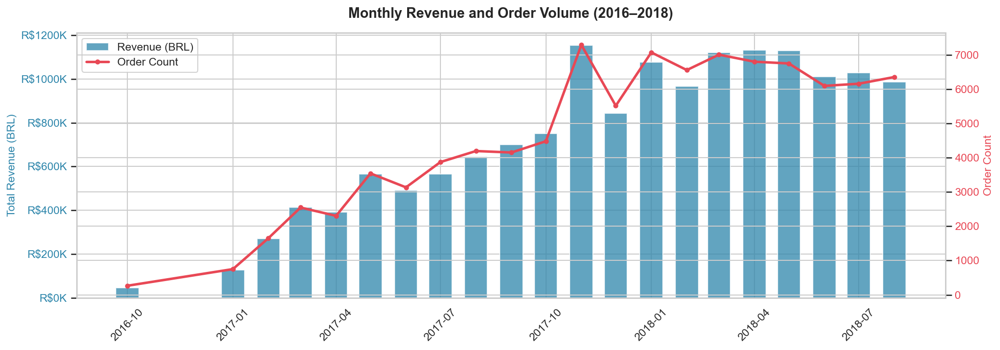

A dual-axis chart combining blue bars for monthly product revenue (left axis) with an orange line for order count (right axis). The chart tells the complete growth story of the business: a slow start in late 2016, consistent growth through 2017, a clear peak in November 2017 likely driven by Black Friday promotional activity, and a stabilization phase in 2018 at around R$1M per month. The parallel movement of revenue and order count confirms that growth was driven by volume rather than price increases.

---

### 2 — Top 15 Product Categories by Revenue
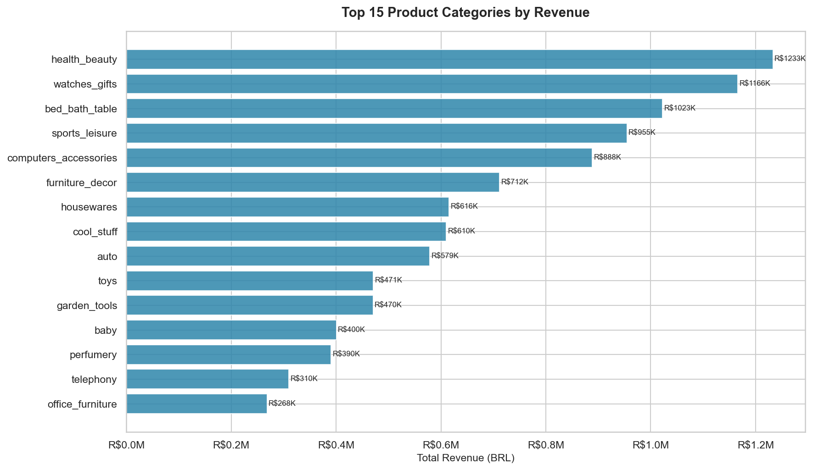

A horizontal bar chart ranking the 15 highest-revenue product categories with exact revenue labels on each bar. Health & Beauty leads at R$1.24M followed closely by Watches & Gifts at R$1.17M. The top 3 categories together account for a significant share of total revenue — a concentration that represents both a strength and a risk. A business analyst would flag this to inform category diversification strategy and inventory prioritization decisions.

---

### 3 — Late Delivery Rate by State
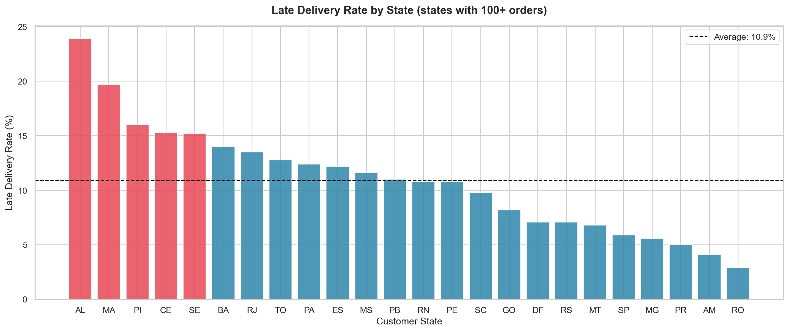

A bar chart showing the late delivery rate for each Brazilian state, color-coded coral for states above the national average (10.9%) and blue for states below it, with a dashed reference line marking the average. States in the northeast — AL at 24.1%, MA at 20.2%, PI at 15.5% — perform more than twice as poorly as the national benchmark. This geographic concentration strongly suggests a logistics infrastructure problem in those regions rather than a product or demand issue, and gives operations teams a clear prioritization signal.

---

### 4 — Impact of Late Delivery on Customer Review Scores
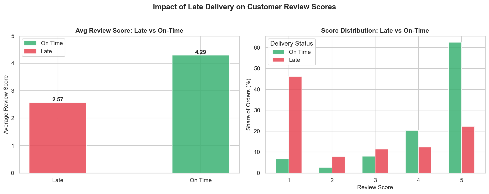

Two side-by-side charts that together quantify the business cost of late delivery. The left bar chart shows the average review score gap: on-time orders receive 4.29 stars versus 2.57 for late orders — a 40% drop in satisfaction. The right grouped bar chart shows the full score distribution, revealing that 46% of late orders receive a 1-star review compared to only 7% of on-time orders. This pairing connects the operational delivery problem (Chart 3) to its financial and reputational consequence, making the case for logistics investment concrete and quantifiable.

---

### 5 — Payment Method Analysis
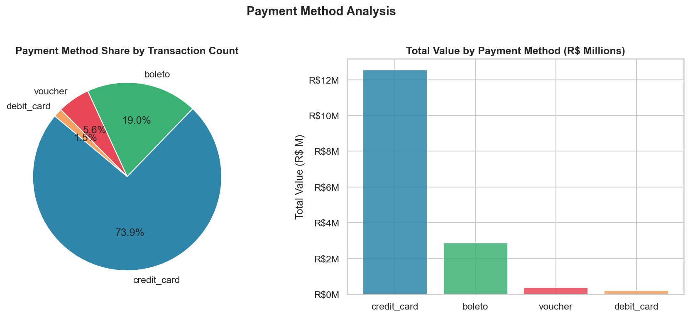

Two charts displayed together: a pie chart showing the transaction share by payment method, and a bar chart showing total revenue by method. Credit card dominates at 73.9% of transactions and R$12.5M in total value. Boleto (a Brazilian bank slip payment) is the only significant alternative at 19% of transactions. The near-absence of debit card usage despite its availability suggests a Brazilian consumer preference pattern that would inform checkout optimization and payment infrastructure decisions.

---

### 6 — Order Volume by Hour of Day
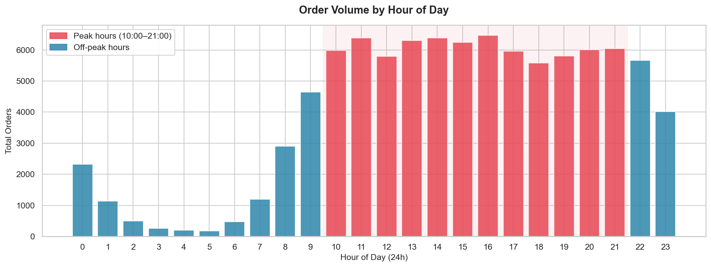

A bar chart showing total order count for each hour of the day, with coral bars marking peak hours (10:00–21:00) and blue bars marking off-peak hours. Order volume rises sharply from 9am, sustains a high plateau throughout the afternoon and evening, and drops significantly after 10pm. The overnight hours (1:00–6:00) are dramatically lower. This pattern has direct implications for customer support staffing, marketing campaign scheduling, and server capacity planning.

---

### 7 — Customer Review Score Distribution
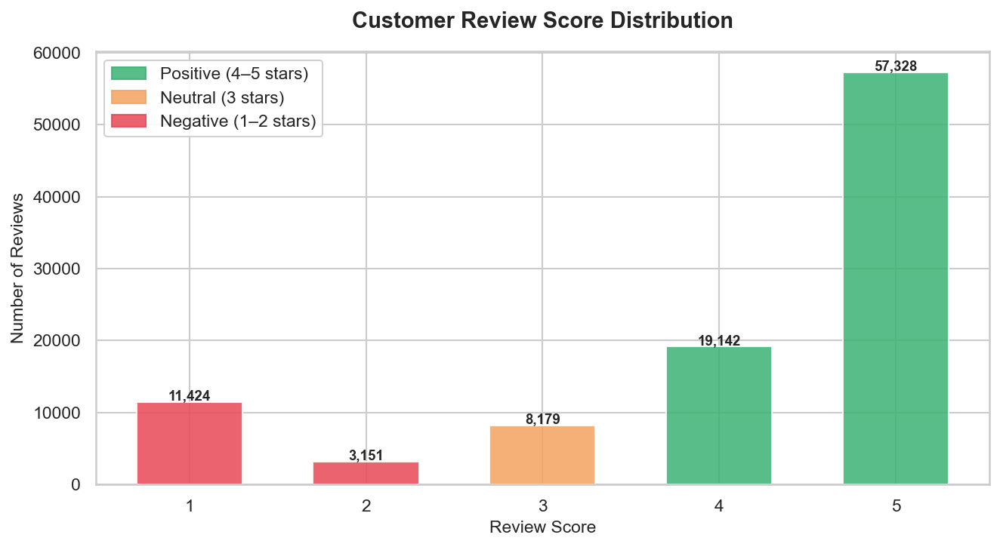

A bar chart showing the count of orders at each review score from 1 to 5, color-coded by sentiment: green for positive (4–5 stars), orange for neutral (3 stars), and coral for negative (1–2 stars). The distribution is strongly right-skewed — 57,328 orders received 5 stars, making it the largest single group. However, 11,424 orders received 1 star, which is disproportionately large relative to scores 2–4. The bimodal pattern suggests customers tend to review only when they have a strongly positive or strongly negative experience — a common e-commerce pattern with implications for review solicitation strategy.

---

## Tableau Dashboard

Four-view interactive dashboard published at the live URL above. The workbook file is also saved at `dashboard_tableau/olist_dashboard.twbx`.

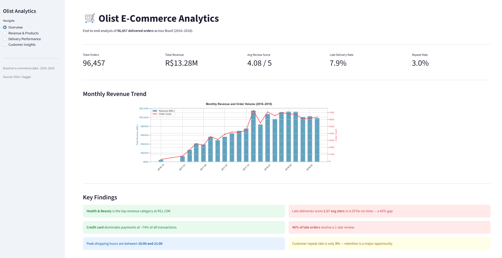

The dashboard presents four complementary analytical views: a dual-axis revenue and order volume trend across the full 2016–2018 period (top), a ranked horizontal bar chart of top product categories by revenue with dollar labels (bottom left), a gradient-colored bar chart of late delivery rates by state where darker red indicates worst-performing states (bottom center), and a side-by-side bar chart comparing average review scores for late versus on-time deliveries with green/red color coding (bottom right). Together these four views form a complete analytical narrative — where is the business growing, which products drive it, where operations are failing, and what that failure costs in customer satisfaction.

---

## Power BI Dashboard

Four-view analytical dashboard built on the pipeline's processed CSV outputs. The `.pbix` file is available at `dashboard_powerbi/olist_dashboard.pbix` and can be opened directly in Power BI Desktop.

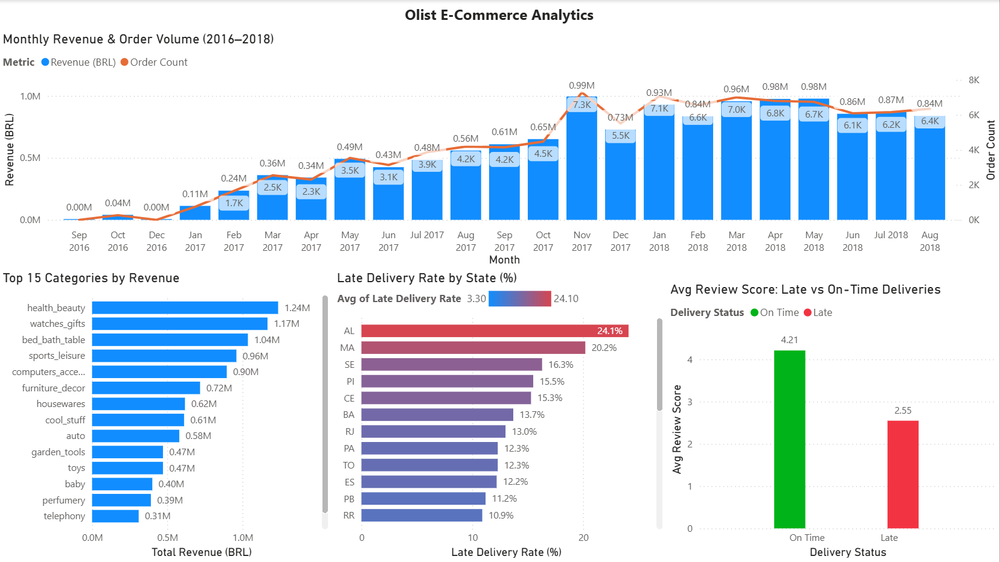

The Power BI dashboard covers the same four analytical dimensions with Power BI-native features: a line and clustered column chart for the revenue trend with independent dual Y-axes, a horizontal clustered bar chart for top categories with visual-level Top N filtering, a conditional-formatted bar chart for delivery by state using a blue-to-red gradient scale driven by the late delivery rate value, and a clustered column chart for review score comparison with a DAX-calculated `Delivery Status` column replacing the raw boolean field. Data labels are enabled on all visuals for immediate readability.

---

## Streamlit App

A 4-page interactive web application built with Streamlit that presents all visualizations alongside KPI metrics and key findings. The app reads from pre-processed CSV files and displays pre-rendered PNG charts for fast loading.

| Page | Content |
|---|---|
| Overview | 5 KPI metrics, monthly revenue trend, key findings summary |
| Revenue & Products | Top 15 categories, payment method analysis, hourly order volume |
| Delivery Performance | Delivery KPIs, late delivery by state, review vs delivery impact |
| Customer Insights | Review distribution, orders and revenue by state, avg review by state |


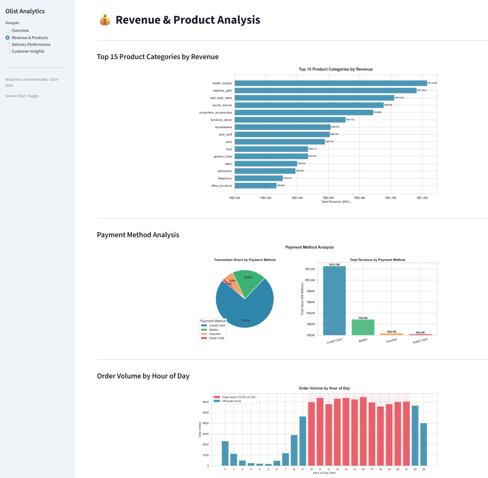
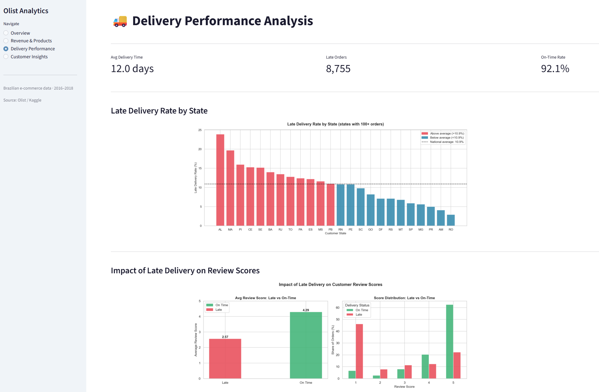
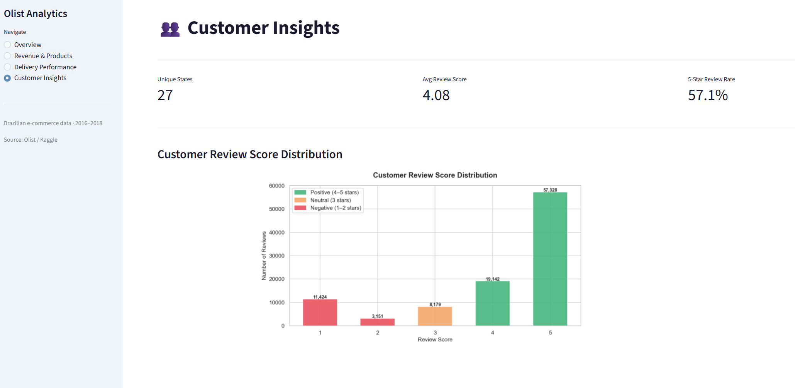

---

## CI/CD Pipeline

Automated testing runs on every push to the `main` branch via GitHub Actions. The pipeline installs Python dependencies, executes 12 unit tests with pytest, and fails the build if any test does not pass — preventing broken code from reaching the main branch.


**Tests cover:** no negative or zero prices, review score range validation (1–5), positive delivery days, no null order IDs, boolean type validation for `is_late`, no null category names after cleaning, non-negative freight values, revenue calculation correctness, month/year extraction from timestamps, duplicate order ID detection, and late delivery rate calculation logic.

```yaml
on:
  push:
    branches: [main]
  pull_request:
    branches: [main]
```

---

## Project Structure

```
ecommerce-analytics-olist/
├── scripts/
│   ├── upload_to_s3.py              # Upload raw CSVs to AWS S3 (optional)
│   ├── load_to_postgres.py          # Ingest all 9 CSVs into PostgreSQL
│   ├── clean_data.py                # Clean all tables → 6 clean tables (Silver layer)
│   ├── validate_data.py             # 18 automated data quality checks
│   ├── generate_visualizations.py   # Generate 7 Matplotlib/Seaborn PNGs
│   └── export_dashboard_data.py     # Export 3 dashboard-ready CSVs
├── sql/
│   ├── create_tables.sql            # PostgreSQL schema with foreign keys
│   └── analysis_queries.sql         # 8 business analysis SQL queries
├── data/
│   ├── raw/                         # 9 Olist CSVs (not tracked in Git)
│   └── processed/                   # Dashboard-ready CSVs (tracked in Git)
│       ├── dashboard_data.csv       # Main flat table (110,814 rows, 21 cols)
│       ├── monthly_summary.csv      # Monthly aggregates (23 rows)
│       └── state_summary.csv        # State-level aggregates (27 rows)
├── notebooks/
│   └── 01_eda.ipynb                 # Exploratory data analysis notebook
├── dashboard_streamlit/
│   └── app.py                       # 4-page Streamlit application
├── dashboard_tableau/
│   └── olist_dashboard.twbx         # Tableau workbook file
├── dashboard_powerbi/
│   └── olist_dashboard.pbix         # Power BI Desktop workbook
├── docs/
│   └── visualizations/              # All PNGs — charts, dashboards, screenshots
│       ├── 01_monthly_revenue.png
│       ├── 02_top_categories.png
│       ├── 03_late_delivery_by_state.png
│       ├── 04_review_vs_lateness.png
│       ├── 05_payment_methods.png
│       ├── 06_hourly_orders.png
│       ├── 07_review_distribution.png
│       ├── powerbi_dashboard.png
│       └── streamlit_screenshots/
│           ├── page1_overview.png
│           ├── page2_revenue_products.png
│           ├── page3_delivery_performance.png
│           └── page4_customer_insights.png
├── tests/
│   └── test_cleaning.py             # 12 pytest unit tests
├── .github/
│   └── workflows/
│       └── ci.yml                   # GitHub Actions CI/CD pipeline
├── .streamlit/
│   └── config.toml                  # Light theme configuration
├── docker-compose.yml               # PostgreSQL 15 service definition
├── requirements.txt                 # Streamlit Cloud dependencies
├── .env.example                     # Environment variable template (no secrets)
└── README.md
```

---

## How to Run

### Prerequisites — Dataset

1. Download the Olist dataset from [Kaggle — Brazilian E-Commerce](https://www.kaggle.com/datasets/olistbr/brazilian-ecommerce)
2. Place all 9 CSV files inside `data/raw/`

> The raw CSV files are excluded from Git via `.gitignore` due to their size. They must be downloaded manually before running the pipeline.

---

### Step 1 — Clone the repository

```bash
git clone https://github.com/emaadkalantarii/ecommerce-analytics-olist.git
cd ecommerce-analytics-olist
```

### Step 2 — Configure environment

Copy `.env.example` to `.env` and fill in your credentials:

```bash
copy .env.example .env   # Windows
cp .env.example .env     # macOS / Linux
```

```env
POSTGRES_HOST=localhost
POSTGRES_PORT=5432
POSTGRES_DB=olist_db
POSTGRES_USER=olist_user
POSTGRES_PASSWORD=olist_pass
AWS_BUCKET_NAME=your-bucket-name
AWS_REGION=eu-west-1
AWS_ACCESS_KEY_ID=your-key
AWS_SECRET_ACCESS_KEY=your-secret
```

> AWS credentials are only needed for `upload_to_s3.py`. All other scripts work without them.

### Step 3 — Create and activate virtual environment

```bash
# Windows
python -m venv olist-venv
olist-venv\Scripts\activate

# macOS / Linux
python -m venv olist-venv
source olist-venv/bin/activate
```

### Step 4 — Install dependencies

```bash
pip install pandas numpy matplotlib seaborn sqlalchemy psycopg2-binary python-dotenv boto3 openpyxl streamlit pytest
```

### Step 5 — Start PostgreSQL container

Make sure Docker Desktop is running, then:

```bash
docker-compose up -d
```

### Step 6 — Run the pipeline in order

```bash
# Optional — upload raw data to AWS S3 (requires AWS credentials)
python scripts/upload_to_s3.py

# Load all 9 raw tables into PostgreSQL
python scripts/load_to_postgres.py

# Clean all tables and produce 6 clean tables (Silver layer)
python scripts/clean_data.py

# Run 18 data quality validation checks
python scripts/validate_data.py

# Generate 7 visualization PNGs
python scripts/generate_visualizations.py

# Export 3 dashboard-ready CSVs
python scripts/export_dashboard_data.py

# Launch the Streamlit app
streamlit run dashboard_streamlit/app.py
```

**Expected outputs after all steps:**
- PostgreSQL database with 9 raw tables + 6 clean tables
- `data/processed/` — 3 dashboard-ready CSV files
- `docs/visualizations/` — 7 PNG chart files
- Streamlit app running at `http://localhost:8501`

### Step 7 — Run unit tests

```bash
pytest tests/ -v
```

All 12 tests should pass in under 5 seconds.

---

## Dataset

| Field | Detail |
|---|---|
| Source | [Olist Brazilian E-Commerce — Kaggle](https://www.kaggle.com/datasets/olistbr/brazilian-ecommerce) |
| Tables | 9 relational CSV files |
| Total orders | 99,441 |
| Delivered orders (analysis scope) | 96,457 |
| Date range | September 2016 – August 2018 |
| Geographic coverage | 27 Brazilian states |
| License | CC BY-NC-SA 4.0 |

---

## Pipeline Outputs

| File | Rows | Description |
|---|---|---|
| `dashboard_data.csv` | 110,814 | Main flat analytical table joining all 6 clean tables |
| `monthly_summary.csv` | 23 | Monthly aggregates: revenue, orders, delivery days, late rate, avg review |
| `state_summary.csv` | 27 | State-level aggregates: revenue, orders, late rate, avg delivery, avg review |

---

## Skills Demonstrated

**Data Analysis:**
- Exploratory data analysis on a real multi-table relational e-commerce dataset
- Missing value handling with three distinct professional strategies (filter, impute, retain) applied per-context
- Feature engineering: delivery duration in days, lateness boolean flag, time-based aggregations
- Business insight extraction across revenue trends, delivery performance, and customer satisfaction

**SQL:**
- Multi-table `JOIN` queries across 6 related tables with enforced foreign key relationships
- `GROUP BY` aggregations across revenue, delivery, seller, payment, and time dimensions
- Subqueries for repeat purchase rate calculation
- `CASE WHEN` for conditional aggregation (late delivery rate, low score percentage)
- `COALESCE` for null-safe category joins across translated category names

**Data Engineering:**
- ETL pipeline with modular single-responsibility scripts and clear execution order
- Bronze/Silver architecture with raw and clean table separation in PostgreSQL
- AWS S3 integration for raw data lake storage using boto3
- 18-check automated data quality validation layer across four check categories
- Docker containerization for reproducible PostgreSQL environment

**Business Intelligence:**
- Tableau Public: dual-axis trend chart, gradient color encoding, 4-view dashboard assembly and publishing
- Power BI: DAX calculated columns, conditional formatting, dual Y-axis, visual-level Top N filtering
- Streamlit: multi-page application with cached data loading and pre-rendered chart display
- Dashboard design: KPI metric cards, color-coded legends, consistent visual language across three platforms

**Software Engineering:**
- GitHub Actions CI/CD with 12 pytest unit tests triggered on every push to main
- Python virtual environment and dependency management
- `.env` based credential management with `.env.example` public template
- Clean project structure separating scripts, SQL, data, dashboards, tests, and documentation

---

## Future Improvements

- **Airflow orchestration** — schedule the full pipeline to run weekly with automated data refresh
- **dbt transformation layer** — replace raw SQL cleaning with dbt models for better versioning and testing
- **Streamlit Cloud deployment** — resolve Python 3.14 compatibility issues to publish the live app publicly
- **Forecasting layer** — add a time-series demand forecast using Prophet to predict future monthly order volume
- **Geospatial choropleth map** — visualize revenue and late delivery rate by state on an interactive Brazil map
- **Seller segmentation** — cluster sellers by performance metrics (revenue, delivery time, review score) using K-means
- **Power BI Service** — publish the Power BI dashboard to Power BI Service for a live public URL

---

## Author

**Emad Kalantari**

Master's in Information and Computer Sciences — University of Luxembourg

[](https://www.linkedin.com/in/emad-kalantari)
[](https://github.com/emaadkalantarii)

---

## License

This project is licensed under the MIT License.

The dataset used in this project is the Olist Brazilian E-Commerce Public Dataset, available on [Kaggle](https://www.kaggle.com/datasets/olistbr/brazilian-ecommerce) under the CC BY-NC-SA 4.0 license.
